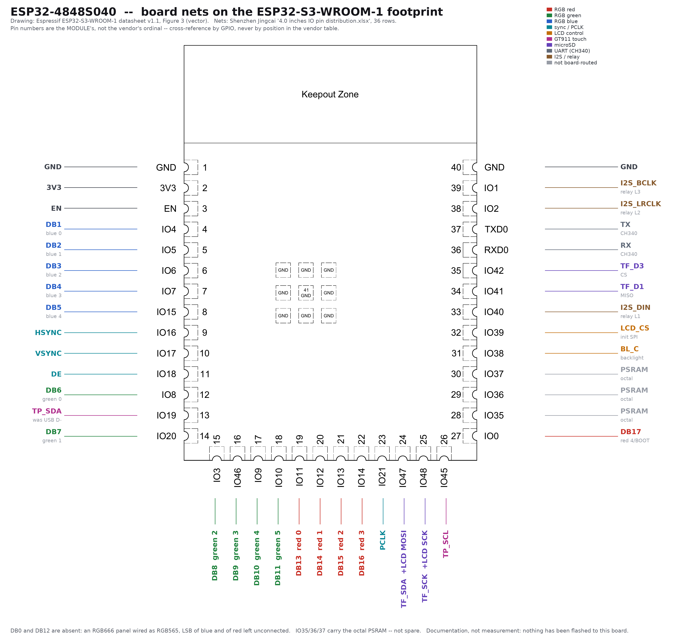

<!-- Copyright 2026 by Frobenius Norm LLC 2026-09-21 -->

# ESP32-4848S040 documentation set

Manufacturer documentation for the board this tree calls **`esp32s3-aitrip-480x480`** —
sold as AITRIP, built by **Shenzhen Jingcai Intelligent Co., Ltd** as
`ESP32-4848S040C_I_Y_3`, also re-badged by Guition and Sunton.
Board definition: [`../../w3_board-aitrip-s3-n16r8.json`](../../w3_board-aitrip-s3-n16r8.json).

Re-download everything with `./fetch_docs.sh`. `MANIFEST.tsv` carries a sha256 for all 37 files.

**`vendor/` and `factory_firmware/` come from the manufacturer's own host**, not from a mirror —
`pan.jczn1688.com` serves a JSON manifest plus content-addressed shards, so the download verifies
itself. `community/` and `web/` are third-party corroboration.

## The pinout



Regenerate with `./make_pinmap.py` &rarr; `ESP32-4848S040_pinout.png` (3970x3710).

It is Espressif's **Figure 3: Pin Layout (Top View)** from the ESP32-S3-WROOM-1 datasheet —
vector art, rendered at 400 dpi — with this board's nets drawn onto it. That figure was chosen
over the other two candidates deliberately; `make_pinmap.py`'s header says why.

It also shows what a flat pin list destroys: **the module has three pin rows, not two.** Pins
15–26 run along the *bottom edge*, and twelve of this board's signals live there — the whole
green and red data group, `PCLK`, both shared SPI pins and `TP_SCL`. The vendor spreadsheet
enumerates all 36 in one column and that row simply vanishes.

> **Pin numbers here are the module's, not the vendor's.** Espressif numbers 1–41; Jingcai
> numbers its own rows 1–36; they do not agree — vendor row 1 is `IO4`, which is module pin 4.
> Cross-reference by GPIO, never by position in a table.

## Read the schematic first

`vendor/5-IO_pin_distribution/schematic_sheet{1,2}_*.png` is Jingcai's own 2-sheet circuit diagram.
**No GitHub mirror of this archive contains it** — it is the reason to fetch from the manufacturer.
Findings, with what each one overturned:
[`SCHEMATIC_FINDINGS.md`](vendor/5-IO_pin_distribution/SCHEMATIC_FINDINGS.md).

The three that change what you can write:

1. **The panel cannot be reset in software.** `LCD1` pin 6 is an RC power-on reset (R16/C21/C22),
   on no GPIO. A wedged ST7701 needs the *power removed* — a reboot will not do it, because the
   module's `EN` resets the ESP32 while the panel's RC network stays charged. So flash-observe-adjust
   is not a valid loop for the init handshake.
2. **GT911 `0x5D` is structural.** `TP_INT` lands on no GPIO and reset is that same RC network, so
   the part can only ever present `0x5D`. A driver that toggles RST to pick the address cannot be
   made to work here.
3. **SD `MISO` is `DAT0`, not `D1`.** The spreadsheet's `TF(D1)` for IO41 is wrong; the schematic
   wires it to `TF1` pin 7. The xlsx is a summary, the schematic is the design.

## The factory application

`factory_firmware/` holds the app the board ships running. **The first LambLisp flash destroys it**;
these are the way back. Flash at `0x10000` with the factory partition table
(`vendor/1-Demo/huge_app.csv` — one factory app, no OTA), not ours.

| image | note |
|---|---|
| `JC4848W540C_I_W-V2.1-NEWUI.bin` | the newer factory UI; **absent from every GitHub mirror** |
| `86Switch_onoff_v1.3.bin` | the clock/weather switch panel shown in the spec sheet |
| `switch86_lvgl_music.bin` | music-player demo |
| `4.0_LvglWidgets.bin` | the LVGL widgets demo |
| `86switch_onoff.ino.{bootloader,partitions}.bin` | needed with the app images — they are app-only |

Which one this board actually shipped with is **not established** — and a published `.bin` is a
different *build*, not this board's image. Take its own flash before the first LambLisp write:

```
./w3 board claim <env> -- "dumping factory firmware"
./w3 dev_flashdump <env>            # -> w3_logs/flashdump/<env>-<mac>-<stamp>.bin + .json
```

That dump is the real restore point. The published images below are the fallback if it was already
overwritten.

### Flashing a vendor image

**The `Burn files/*.bin` are COMBINED images — bootloader + partition table + app — and go at
`0x0`.** This README previously said they were "app images only, no bootloader, no partition
table", which is wrong, and wrong in a way that wastes an afternoon: writing one to `0x10000`
verifies clean and then boot-loops with `rst:0x3 (RTC_SW_SYS_RST)` and no app output, because the
app lands under a bootloader and a partition table that belong to a different layout. Measured
2026-09-22 by doing exactly that.

```
./w3 dev_flashwrite <env> 0x0:factory_firmware/4.0_LvglWidgets.bin
```

Each carries its **own** table — they are not interchangeable:

| image | app0 | rest of the layout |
|---|---|---|
| `4.0_LvglWidgets.bin` | `0x10000` size `0x140000` | **OTA pair** + `spiffs` at `0x290000` |
| `86Switch_onoff_v1.3.bin` | `0x10000` size `0x700000` | `spiffs` at `0x710000` |
| `JC4848W540C_I_W-V2.1-NEWUI.bin` | `0x10000` size `0x7E0000` | no OTA, no spiffs — matches `huge_app.csv` |

The vendor's own burn screenshot (`vendor/8-Burn_operation/Burn_operation-2.png`) shows one file at
`0x0`, SPI mode QIO, 80 MHz, `DoNotChgBin` checked — so the image's own header stands.

`86switch_onoff.ino.{bootloader,partitions}.bin` are the odd ones out: genuinely partial, from the
Arduino build tree, and only useful for rebuilding that demo from source.

### Restoring the board's own image

```
./w3 dev_flashwrite <env> --restore factory_firmware/as_delivered/<...>.full-flash.bin.xz
```

Writes the whole 16 MB — bootloader, table and app together — so no layout question arises. The
verb refuses unless a dump for that board's MAC is already on record.

## The only pin *table* is a spreadsheet

**The factory package contains no pin diagram.** The entire pin map exists as one file:

    vendor/5-IO_pin_distribution/4.0_inches_IO_pin_distribution.xlsx

36 rows, three columns. `vendor/5-IO_pin_distribution/ESP32-S3-WROOM-1_Pin_definition.png`
looks like the answer and is not — it is Espressif's *generic* WROOM-1 pinout, identical for
every board using that module, and it says nothing about this one. Do not cite it as a board
pinout; two community write-ups do.

Its "Serial Number" column 1–36 is not arbitrary: it walks the WROOM-1's physical pins, 1–17
down the left side and 18–36 down the right. So the spreadsheet *is* a pinout, just not drawn.

## What the table settles that the community sources did not

* **The colour groups.** `IO4 5 6 7 15` is **blue**, `IO11 12 13 14 0` is **red**. Third-party
  sources disagreed on this; the vendor does not. The bus *order* was never in doubt — and the
  schematic's `LCD1` connector confirms the whole mapping a second time, independently.
* **It is an RGB666 panel wired as RGB565.** The vendor numbers the lines `DB1–DB5` (B),
  `DB6–DB11` (G), `DB13–DB17` (R). **`DB0` and `DB12` are absent** — the dropped LSBs of blue
  and red. The 5-6-5 is in the copper, not in a driver setting.
* **`IO35/36/37` are not spare.** They appear with an empty Connect column, which reads as three
  free GPIO. On an N16R8 module those three are the octal PSRAM. Usable spare GPIO is zero.
* **There is no LCD reset pin.** Reset happens inside the 3-wire SPI init sequence.
* **Audio and relay are the same three pins** (`IO1`/`IO2`/`IO40`), selected by **0-ohm jumpers on
  one board** — not by SKU. As shipped `R25/R26/R27` are fitted (relay); moving them to
  `R21/R22/R23` switches the same pins to I²S. The check is *which resistors are populated*.

## Layout

| path | what it is |
|---|---|
| `vendor/` | the factory package, byte-for-byte — spec, dimensions, driver datasheets, pin xlsx, user manual, and the demo sources that declare pins |
| `community/` | independent derivations, kept because they agree and so corroborate: NorthernMan54, FigueiredoStable (LovyanGFX + ST7701 init sequence), esp-arduino-libs |
| `web/` | ESPHome / homeding / alaltitov pages, saved as served |
| `make_pinmap.py` | regenerates the pinout above from `vendor/` — nothing else depends on it |
| `fetch_docs.sh` | re-downloads everything; rewrites `MANIFEST.tsv` |

### The mirror was the wrong source, and "byte-identical" was never checked

An earlier version of this file said the vendor archive was "not fetchable by script" and sourced
`vendor/` from two GitHub repos instead, calling the result byte-identical. Both claims were
written from inspection and neither was tested. Measured 2026-09-21 by diffing them:

| | |
|---|---|
| binaries identical | 18 of 18 |
| text files differing | **4 of 22** — sizes consistent with CRLF→LF in transit |
| firmware the mirror lacks | `86Switch_onoff_v1.3.bin`, `JC4848W540C_I_W-V2.1-NEWUI.bin` |
| **schematic the mirror lacks** | **both sheets** — and three fields in the board JSON were wrong because of it |

The general point: **a mirror can be trusted but not checked; a content-addressed original can be
checked.** `pan.jczn1688.com` names every shard by its own sha256, so `fetch_docs.sh` verifies each
one and refuses to assemble on mismatch — strictly better provenance than any copy.

### Deliberately not fetched

`flash_download_tool_3.9.3` (a 16 MB Windows `.exe` plus ~150 stale burn logs carrying other
people's MAC addresses), the WinHex and CH340-driver `.rar` bundles, the prebuilt demo `.bin`
images, and the LVGL font/image C blobs. None document the board; together they are ~40 MB.

## Status

**Documentation, not measurement.** Nothing has been flashed to this board and no pixel has been
lit. The vendor is the best available source and three third parties agree with it, but the
first flash is what converts any of this to fact. Identity is further complicated by [B548]: the
board's CH340 exposes no serial number, so `usbenum` cannot name it — MAC `ac:27:6e:a4:b5:48`,
read over `esptool`, is its only stable identifier.

## Where this came from (all verified live 2026-09-22)

**Everything below is already in this directory** — `fetch_docs.sh` re-pulls it. These are for when
you need something we did not take.

### Manufacturer — Shenzhen Jingcai Intelligent

| | |
|---|---|
| `pan.jczn1688.com` | the file host. **The archive:** `http://pan.jczn1688.com/directlink/1/ESP32 module/4.0inch_ESP32-4848S040.zip` (87 MB) |
| `www.displaysmodule.com` | the storefront. Product page: `/sale-41828962-experience-the-power-of-the-esp32-display-module-sku-esp32-4848s040c-i-y-3.html` |
| `www.jczn1688.com` | the corporate site — **returns 530, down** as of 2026-09-22 |

**The file host has no directory listing.** `/api/manifest/<exact/path>` answers only for a file
that exists; the directory path returns `{"detail":"文件不存在"}` and there is no `list`/`dir`/`files`
endpoint. So you cannot browse it — you need the exact filename, and the way we got ours was the
link in esp-arduino-libs' `board_jingcai.md` below. For a *different* Jingcai panel, start there or
at the product page, not at the host.

Fetching is scriptable and self-verifying: `GET /api/manifest/<path>` returns
`{size, shard_count, shards:[{seq, sha256, size, url}]}`, and each shard is served from
`/s/<sha256>` with header `X-Gdisk-Fetch: 1`. Every shard is named by its own hash.

### Community — independent, and they agree with the vendor on every GPIO

| | |
|---|---|
| `github.com/esp-arduino-libs/ESP32_Display_Panel` | `docs/board/board_jingcai.md` — **this is where the vendor download link came from**, plus the recommended Arduino settings (OPI PSRAM, QIO flash, 16 MB) that independently confirm our `qio_opi` |
| `devices.esphome.io/devices/guition-esp32-s3-4848s040/` | ESPHome device page, full pin YAML |
| `homeding.github.io/boards/esp32s3/panel-4848S040.htm` | hardware table |
| `alaltitov.github.io/Guition-ESP32-S3-4848S040-DOCS/` | a docs site for a Home Assistant firmware for this panel |
| `github.com/NorthernMan54/ESP32-4848S040` | unpacked an **older** revision of the archive into git |
| `github.com/FigueiredoStable/LovyanGFX-GUITION-ESP32-4848S040` | same, plus a LovyanGFX config carrying the ST7701 init sequence |

The last two are the mirrors that cost us the schematic — see the section above. Useful as
corroboration; not a substitute for the vendor archive.
